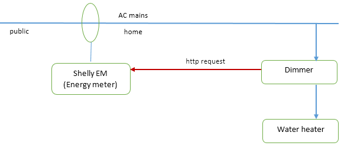
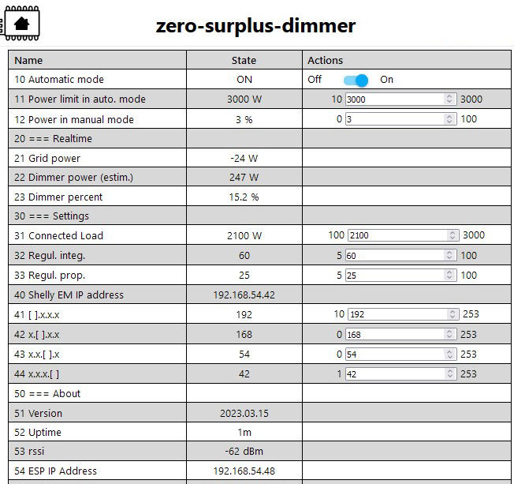

# Zero-Surplus-Dimmer

## When is this project useful?

- You have some energy production (typically solar panels).
- You want to self-consume as much as possible of this energy.
- You have a device (typically a water heater) which could consume the part of the energy, which would otherwise be injected into the public electricity grid.
- You have an energy meter which measures the power consumed by your household (a Shelly EM). The power can be either positive (power is consumed) or negative (power is injected into the public electricity grid).

Please note if you want to integrate such a system in some home automation project, it may be useful to have a look at another project: the [Energy Router](https://github.com/frtz13/EnergyRouter/).

## What do you need?

- A **Shelly EM** energy meter
- The **dimmer**. You will need some basic electronic skills to assemble it yourself. You will also need to uplaod the binary to the micro controller.

## How does it work ?

The Dimmer is composed of a ESP8266 microcontroller, connected to a Robotdyn dimmer.

The microcontroller regularly requests the energy flow from the energy meter. When the energy flow is negative, i.e. we have surplus energy available, it commands the Robotdyn dimmer to deliver more energy to the Water heater.

The microcontroller implements a regulation loop to send as much energy as possible to the water heater, thus keeping the energy flow close to zero whenever possible.

When the energy flow is positive, meaning the household consumes energy, the Robotdyn dimmer is shut down.

## How to put this together?

#### The Shelly EM energy meter

- Install the Shelly EM as required in the fuse box of the household.

- Connect it to your wireless network.

- Once connected to your wireless network, find out its IP address. How? You may have a look in the configuration pages of your wireless router (DHCP leases page), or use a tool like the [advanced IP scanner]([Advanced IP Scanner - Download Free Network Scanner.](https://www.advanced-ip-scanner.com/download/)).

- Once you know it IP address, you can use your favourite browser to connect to the Shelly EM web interface.

#### The Dimmer

- Assemble the dimmer, according to the schematics in this repository.

- Download the binary, or compile it yourself with ESPHome.

- Flash the ESPHome binary to the ESP8266 board (a D1-Mini works fine, others should, too). Either use the ESPHome tools, or the  [NodeMCU-PyFlasher]([Releases · marcelstoer/nodemcu-pyflasher · GitHub](https://github.com/marcelstoer/nodemcu-pyflasher/releases)). In this procedure, you should completely erase the ESP flash memory.

- Power on the dimmer. Connect your smartphone to the WiFi hotspot of the dimmer, then to the IP address 192.168.4.1. Fill in the credentials of your wireless network.

- When the dimmer reboots, it should connect to your wireless network. Now you will need to find out the IP Address it has been assigned in your wireless network (using the same procedure as previously with the Shelly EM). 

- Once you found the IP address of the dimmer, use a browser to connect to the web interface of the dimmer.

## Parameters

First of all, you should enter the IP address of the Shelly EM. Once this is done correctly, you should get grid power readings (line 21). Note that the Automatic mode switch should be in the "On" position. Grid power readings should be positive for power consumption, negative for power injection into the public power grid.

Please configure the value of the Connected Load (electric power of the water heater).

You can leave the Regul... parameters at the default values.

#### Operation

**Automatic mode** means: the Dimmer will try to send the surplus power to the water heater. The Dimmer power (line 22) gives you an estimate how much power is sent to the water heater. In automatic mode, with sufficient solar power, the grid power readings should be small (less than +-20W), unless we have rapid changes of power production or power consumption inside the house.

The Power limit in auto. mode (line 11) lets you set the maximum power to send to the water heater in automatic mode. Sometimes, water heaters have a security feature imprlemented by a bi-metal switch, which interrupts the current flow when the heating elements get too hot. If you do not want to use this feature, just set the limit to the highest possible value.

**Manual mode** (Automatic mode: off) means that the dimmer sends power to the water heater, regardless if surplus power is available, or not. The Power in manual mode (line 12) decides how much power is sent to the water heater. Thus you can get hot water even in bad weather.

#### The ESPHome code

For simplicity, all security features have been removed in the ESPHome code. You may want to recompile the binary, after enabling passwords for access to the web interface, Over-the-air updates, or hard coding the credentials of your WiFi network.
